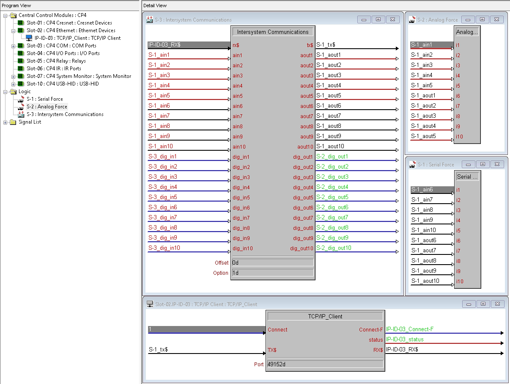

# node-red-contrib-crestron-isc

A Node-RED node that speaks the Crestron ISC (Intersystems Communications) protocol over TCP.

## Install

```bash
cd ~/.node-red
npm install /path/to/node-red-contrib-crestron-isc
```

Or, for development:

```bash
cd /path/to/node-red-contrib-crestron-isc
npm link
cd ~/.node-red
npm link node-red-contrib-crestron-isc
```

Then restart Node-RED. The **Crestron ISC** node appears in the *network* category of the palette.

## Usage

Drop one node, configure it, then wire upstream producers into its input and downstream consumers
from its output.

### Inputs

| `msg` field | type                              | meaning                                                  |
|-------------|-----------------------------------|----------------------------------------------------------|
| `topic`     | `"digital"` / `"analog"` / `"serial"` | ISC signal type to send                              |
| `channel`   | number, or array of numbers       | Signal channel (1-indexed)                               |
| `payload`   | boolean / number / string / array | Signal value (see below); arrays parallel `channel`      |

Per-topic payload types:

- **digital**: boolean (or 0/1)
- **analog**: integer 0..65535
- **serial**: latin1 string, non-empty, no `0xFF` bytes

### Outputs

One `msg` per decoded ISC frame, with `topic`, `channel`, and `payload` populated using the same
conventions.

## Configuration

| Field                  | Default  | Notes                                                              |
|------------------------|----------|--------------------------------------------------------------------|
| Mode                   | server   | `Server (listen)` accepts incoming connections; `Client (connect)` dials out |
| Host                   | —        | Client mode only: the Crestron processor's IP                      |
| Port                   | 49152    | TCP port (1..65535)                                                |
| Reconnect (ms)         | 3000     | Client mode only: wait between reconnect attempts                  |
| Total Analog Signals   | 0        | Total count of analog + serial signals on the ISC symbol           |

**Total Analog Signals** must match the count of analog + serial signals defined on the Crestron
ISC symbol in the SIMPL program. Both sides of the symbol must have identical quantities. This
value is used as the digital channel offset in the wire protocol.

## Crestron program setup

Wire your SIMPL Windows program as shown:



Key elements:

1. **Intersystem Communications symbol** in your program logic. Configure as many `ain*/aout*`,
   `dig_in*/dig_out*`, and serial input/output pairs as your application needs. Both sides of the
   symbol (the inputs and the matching outputs) must have **identical quantities**.
2. **TCP/IP Client (or Server) symbol** on the Ethernet slot, with its `RX$` and `TX$` wired to
   the ISC symbol's `rx$` and `tx$` pins respectively. The `Connect` input drives whether the
   processor is connected.
3. **Port** on the TCP/IP symbol must match the **Port** in the Node-RED node. The example uses
   `49152`.
4. **Direction**:
   - If the Node-RED node is configured as **Server (listen)**, use a Crestron **TCP/IP Client**
     symbol pointed at the Node-RED host's IP.
   - If the Node-RED node is configured as **Client (connect)**, use a Crestron **TCP/IP Server**
     symbol listening on the same port.
5. **Total Analog Signals** in the Node-RED node must equal the number of analog + serial signal
   pairs on the ISC symbol.

## Multi-client behavior

In server mode, encoded frames are **broadcast to every connected client**. Incoming bytes are
buffered per-connection, so frames from different peers cannot interleave. ISC is normally a
one-to-one peer link, so broadcast collapses to unicast in typical use, but it allows tools (e.g.
a tester or monitor) to connect alongside a live Crestron without bumping anyone off.

## Status indicator

| Color  | Shape | Meaning                                          |
|--------|-------|--------------------------------------------------|
| blue   | ring  | Server: listening on the port                    |
| green  | dot   | One or more clients connected                    |
| yellow | ring  | Client mode: waiting to reconnect                |
| red    | ring  | Error (port in use, missing host, socket error)  |

## License

MIT
